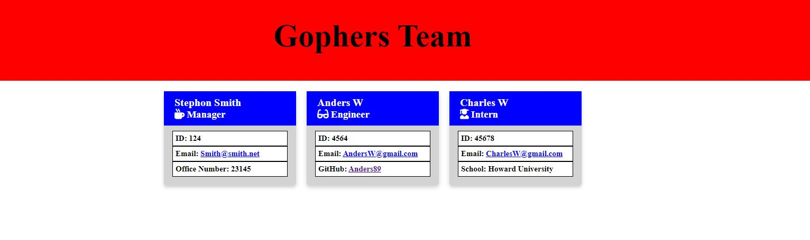
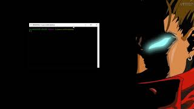
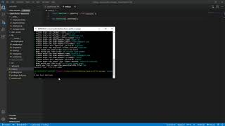

# [Team Profile Manager](http://www.github.com/SmithBWare89/team-profile-manager)

## Description
This project will provide a simplified way to input, track, and manage the profiles of a team. It allows each time to have a manager along with their associated Engineers and Interns listed along with their contact information. Each user will have their own respective data card to keep all information contained on the webpage neatly organized.

## Table of Contents
* [Installation](#installation)
* [Usage](#usage)
* [License](#license)
* [Languages](#languages)
* [Contributing](#contributing)
* [Collaborator](#collaborators)
* [Tests](#test)

## Installation
`Clone` the repository from the provided GitHub link then run `npm install` to install all Node packages.

## Usage
Once the repository has been cloned onto your local drive, you've navigated to the directory in your terminal, and all Node packages installed then you can run `node index` in your console to begin the process of building your team.

## License

## Languages

## Contributing
Submit any requests or contributions to the e-mail listed under "Questions".

## Collaborators
There were no other contributors to this project.

## Test
This project uses the Jest package to allow the user to run tests on the constructor classes. In your console you can run a test by inputting `"npm test file-name-to-test"` An example would be to run `"npm test manager"` to test the manager constructor classes. You can also run Jest in watch mode using `"npm test:watch"` to monitor your files and run tests upon saving the document.

## Questions
All questions can be directed to [my email](SmithWrestling89@gmail.com) or [github](https://www.github.com/SmithBWare89).
  